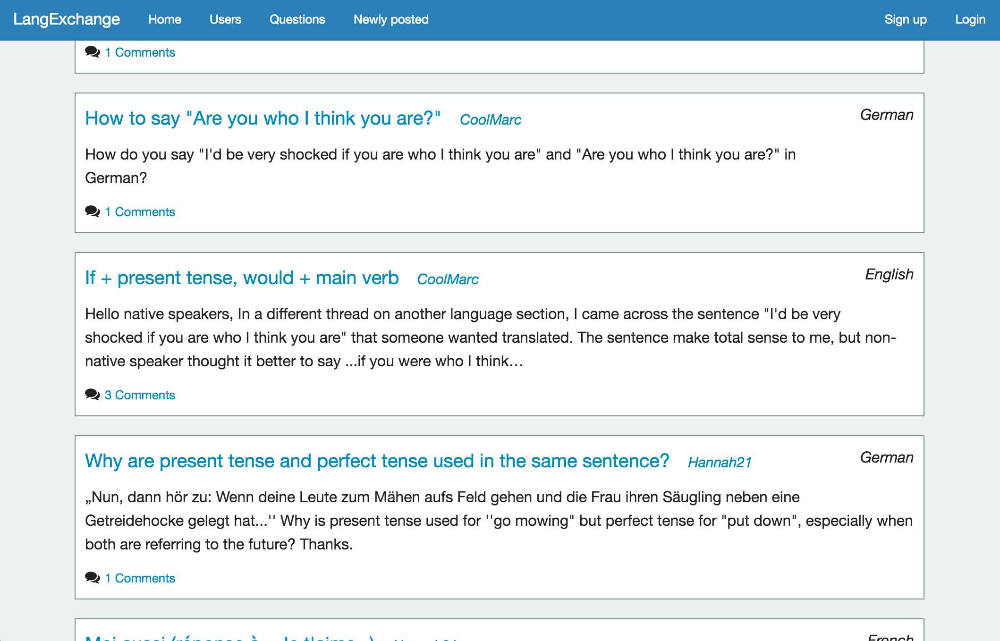

# LangExchange

An online social platform for language learners. Users ask questions about the languages they're learning and get responses from native speakers.

[https://robin-langexchange.herokuapp.com/](https://robin-langexchange.herokuapp.com/)

</img>

## Technology

**Languages/Frameworks:** Ruby, HTML, CSS, jQuery, PostgreSQL, Foundation

**Packages (Gems):** Devise, Ransack

## Planning

* [Wireframes](http://imgur.com/a/Iu1CB) 
* [Trello](https://trello.com/b/GTb0yaNh/langexchange)

## Future plans

- Voting on comments
- Integrated machine translation
- Profile pages